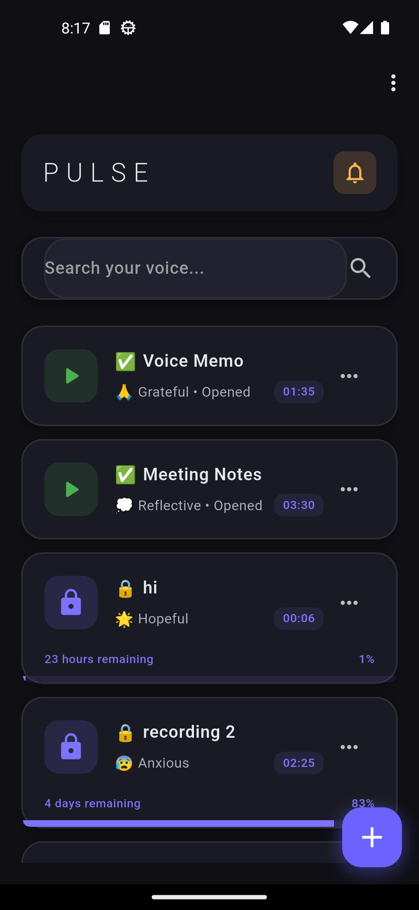
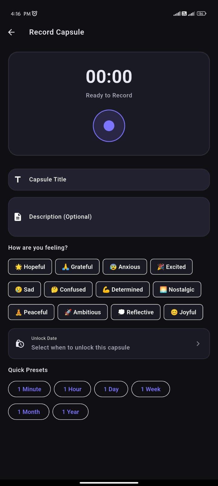

# P.U.L.S.E | Personal Unseen Locker for Special Experience

<div align="center">

**A personal digital time capsule where you record voice messages for your future self, locked until a chosen date with no way to bypass time—completely offline and private.**

[Features](#-features) • [Screenshots](#-screenshots) • [Installation](#-installation) • [Tech Stack](#-tech-stack) • [Architecture](#-architecture)

</div>

---

## 📖 About

P.U.L.S.E is a unique Flutter application that lets you create audio time capsules—voice recordings that remain locked until a specific date you choose. Whether it's a message to your future self, memories you want to preserve, or goals you want to revisit, P.U.L.S.E keeps them secure until the perfect moment.

### 🎯 Core Concept

- 🎤 **Record** voice messages with emotion tags and descriptions
- 🔒 **Lock** them until a future date (from 1 minute to years ahead)
- ⏰ **Wait** as the countdown shows time remaining
- 🎧 **Open** and listen when the unlock time arrives
- 🔔 **Get notified** when capsules are ready to open //planned

### ✨ Key Highlights

- **No Bypassing**: Once locked, capsules cannot be opened until the unlock time—no exceptions
- **Completely Offline**: All data stored locally on your device using Hive database
- **100% Private**: No cloud storage, no servers, no data collection
- **Rich Emotions**: Tag capsules with 12 different emotions (hopeful, grateful, excited, etc.)
- **Smart Notifications**: Get reminders 1 day before and when capsules unlock//planned
- **Beautiful UI**: Modern dark theme with smooth animations and intuitive design

---

## 🎨 Screenshots

<div align="center">

### Home Screen



_View all your locked capsules with countdown timers and unlock dates_

### Recording Screen



_Record voice messages with quick presets for unlock times_

### Played Capsules


_Browse and replay your opened capsules_

</div>

---

## 🚀 Features

### 🎙️ Recording & Creation

- **High-quality audio recording** with AAC encoding (128kbps, 44.1kHz)
- **Record up to 5 minutes** per capsule
- **Quick preset buttons**: 1 minute, 1 hour, 1 day, 1 week, 1 month, 1 year
- **Custom date & time picker** for precise unlock scheduling
- **12 emotion tags** to categorize your feelings
- **Title & description** fields for context
- **Real-time duration counter** during recording
- **Pause & resume** recording capability

### 🔒 Time Lock System

- **Absolute time lock**: No way to access before unlock time
- **Visual countdown timers** showing remaining time
- **Three capsule states**:
  - 🔒 **Locked**: Still waiting for unlock time
  - 🟢 **Unlockable**: Ready to open
  - ✅ **Opened**: Already played
- **Progress bars** showing time elapsed vs. remaining
- **Lock state indicators** on each capsule card

### 🔔 Smart Notifications//planned

- **Unlock notifications**: Alerted when capsules are ready
- **1-day reminder**: Heads-up notification 24 hours before unlock
- **Tap to open**: Notification tap navigates directly to the capsule
- **Background scheduling**: Works even when app is closed
- **Platform-specific**: Native Android & iOS notification support

### 🎧 Audio Playback

- **Full-featured audio player** with play/pause/seek controls
- **Visual waveform representation** (progress slider)
- **Time display**: Current position and total duration
- **Auto-mark as opened** on first play
- **Beautiful player UI** with emotion emoji display

### 🔍 Search & Organization

- **Real-time search** across titles and descriptions
- **Animated search bar** with focus effects
- **Clear button** for quick search reset
- **Search result counter** showing matches
- **Sort by unlock date**: Soonest capsules appear first
- **Separate screens** for locked and played capsules
- **Pull-to-refresh** on both screens

### 🎨 User Experience

- **Modern dark theme** with royal purple accents (#7C73FF)
- **Smooth animations** throughout the app
- **Empty state designs** with helpful messages
- **Undo delete**: Restore accidentally deleted capsules
- **Notification permissions** handled gracefully
- **Responsive layouts** for different screen sizes

---

## 📱 Installation

### Prerequisites

- Flutter SDK 3.8.1 or higher
- Dart SDK 3.8.1 or higher
- Android Studio / Xcode for platform-specific builds
- Android API level 23+ or iOS 12.0+

### Setup

1. **Clone the repository**

   ```bash
   git clone https://github.com/4bhisheksharma/P.U.L.S.E.git
   cd pulse
   ```

2. **Install dependencies**

   ```bash
   flutter pub get
   ```

3. **Generate Hive adapters**

   ```bash
   flutter pub run build_runner build --delete-conflicting-outputs
   ```

4. **Run the app**

   ```bash
   # Android
   flutter run

   # iOS
   flutter run --device ios
   ```

---

## 🛠️ Tech Stack

### Framework & Language

- **Flutter 3.8.1**: Cross-platform UI framework
- **Dart 3.8.1**: Programming language
- **Material Design 3**: Design system

### Core Dependencies

#### Data & Storage

- **hive** (^2.2.3) & **hive_flutter** (^1.1.0): Local NoSQL database
- **path_provider** (^2.1.4): File system path access

#### Audio

- **record** (^6.1.2): Audio recording
- **audioplayers** (^6.5.1): Audio playback

#### Notifications

- **flutter_local_notifications** (^18.0.1): Local push notifications
- **timezone** (^0.9.4): Timezone handling for scheduled notifications
- **flutter_timezone** (^4.1.0): Device timezone for accurate unlock alerts

#### Utilities

- **uuid** (^4.5.1): Unique ID generation
- **intl** (^0.19.0): Date/time formatting
- **url_launcher** (^6.3.2): Open privacy and data-deletion policy links
- **permission_handler** (^11.3.1): Microphone permission UX

### Development Tools

- **build_runner** (^2.4.13): Code generation
- **hive_generator** (^2.0.1): Hive adapter generation
- **flutter_lints** (^5.0.0): Linting rules

---

## 🏗️ Architecture

### Project Structure

```
lib/
├── main.dart                      # App entry point
├── app.dart                       # Root widget
├── app_view.dart                  # App configuration & routing
│
├── models/                        # Data models
│   ├── voice_capsule.dart        # Main capsule model (Hive)
│   ├── capsule_enums.dart        # Emotion tags & states
│   └── models.dart               # Exports
│
├── screens/                       # UI screens
│   ├── home_screen.dart          # Main capsule list
│   ├── recording/
│   │   └── recording_screen.dart # Audio recording
│   ├── player/
│   │   └── audio_player_screen.dart # Audio playback
│   ├── played/
│   │   └── played_capsules_screen.dart # Opened capsules
│   └── screens.dart              # Exports
│
├── services/                      # Business logic
│   ├── capsule_database.dart    # Hive database operations
│   ├── notification_service.dart # Push notifications
│   └── services.dart             # Exports
│
├── widgets/                       # Reusable components
│   ├── home/
│   │   ├── capsule_card.dart    # Capsule display card
│   │   ├── search_bar_widget.dart # Search input
│   │   └── recording_card.dart   # Recording display
│   └── common/
│       └── live_countdown_timer.dart # Real-time countdown
│
├── theme/
│   └── my_app_theme.dart         # App theming & colors
│
└── utils/
    └── capsule_actions.dart       # Share, rename, snackbars
```


---

## 🎯 Use Cases

### Personal Growth

- Record monthly reflections and listen after a year
- Set goals and check progress after 6 months
- Document important life decisions for future reference

### Memories

- Capture birthday wishes to play next year
- Record pregnancy journey messages for your future child
- Save anniversary messages for your partner

### Time Capsules

- New Year's resolutions to open on Dec 31st
- Graduation messages to open at reunion
- Therapy progress notes for future self

---

## 🔒 Privacy & Security

### Data Storage

- ✅ **100% Local**: All capsule metadata stored on device using Hive
- ✅ **No Cloud**: No servers, accounts, or remote data sync
- ✅ **No Tracking**: Zero analytics or telemetry
- ✅ **Device-protected**: Audio files live in the app documents directory; security depends on your device lock and OS encryption
- ℹ️ **Hive is not encrypted** in the current app build (plain Hive boxes)

### Limited Network Use

The app works offline for all core features. A small amount of network activity may occur:

- **Google Fonts**: The Inter typeface may be downloaded on first use
- **Google Play In-App Updates** (Android only): Checks for app updates via the Play Store
- **User-initiated sharing**: Exporting a capsule uses the OS share sheet (your choice of destination)

No voice recordings or capsule metadata are sent to developer-operated servers.

### Permissions

- **Microphone**: Required for audio recording
- **Notifications**: Optional, for unlock alerts
- **Biometrics**: Optional, for app lock

### Data Control

- **Delete anytime**: Remove individual capsules from the home or played screens
- **Delete all data**: Profile → Delete All Data removes all capsules, audio files, app lock, and notifications
- **Privacy links**: Profile → Privacy Policy and Data Deletion (hosted policy URLs)
- **No account needed**: Works immediately after install

---

## 🤝 Contributing

Contributions are welcome! Please follow these steps:

1. Fork the repository
2. Create a feature branch (`git checkout -b feature/AmazingFeature`)
3. Commit changes (`git commit -m 'Add AmazingFeature'`)
4. Push to branch (`git push origin feature/AmazingFeature`)
5. Open a Pull Request

---

## 📄 License

This project is open source. Anyone can use it under my permission.

---

## 👨‍💻 Author

**Abhishek Sharma**

- Portfolio: [@4bhisheksharma](https://abhishek-sharma.com.np)
- Repository: [P.U.L.S.E](https://github.com/4bhisheksharma/P.U.L.S.E)

---

<div align="center">

**Made with ❤️ using Flutter**

⭐ Star this repo if you find it useful!

</div>
